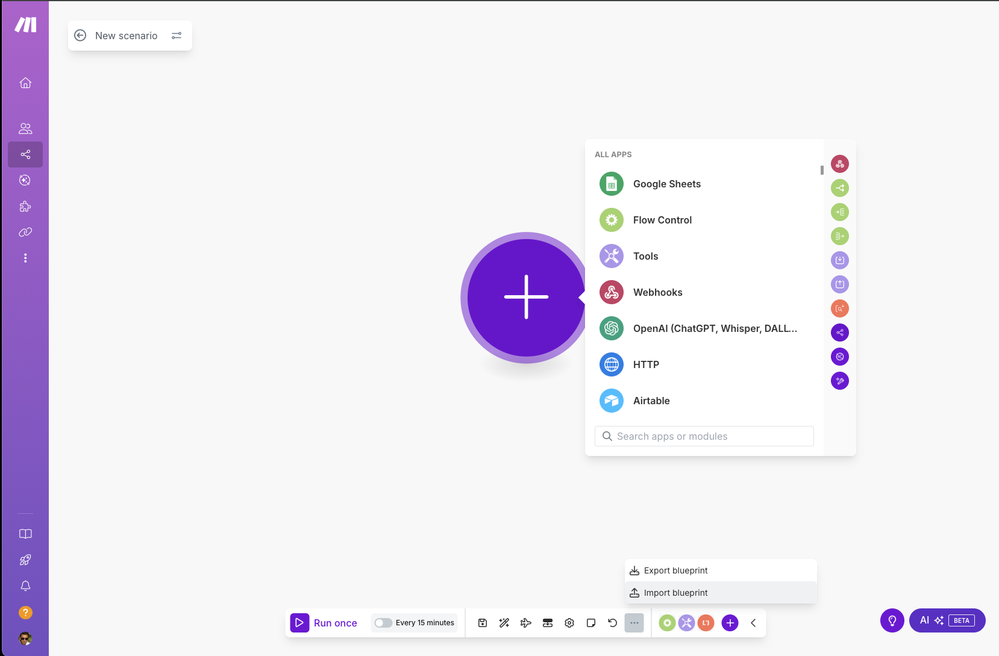
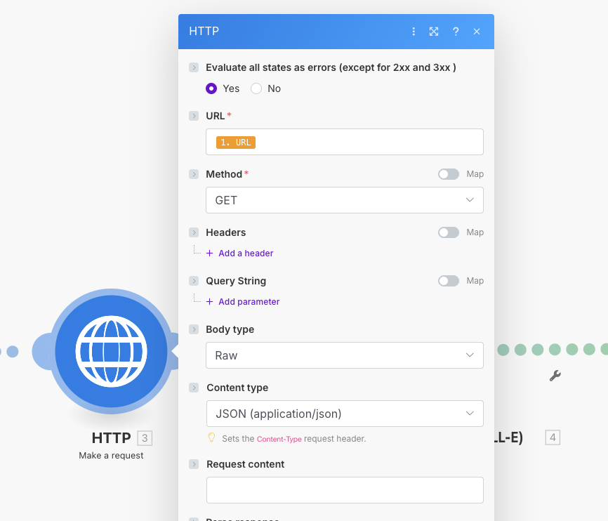
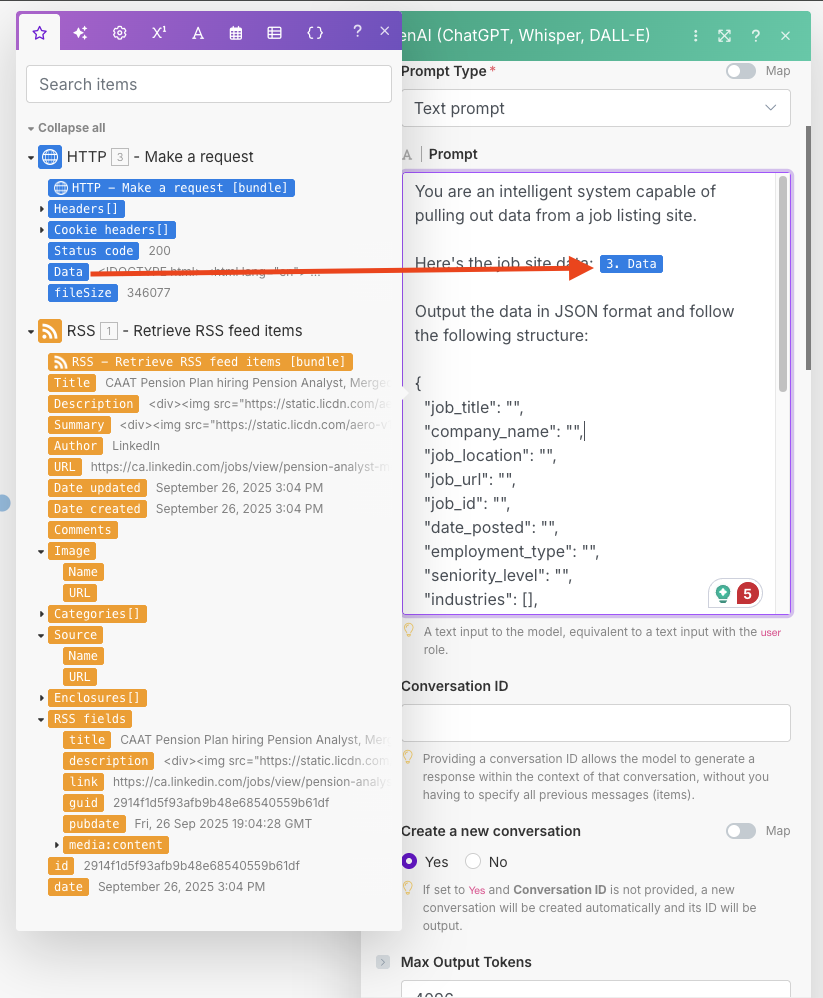
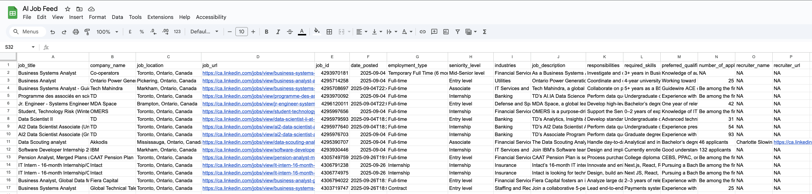

## Introduction

This guide walks you through setting up **LinkedIn Latest Job Automation** on Make.com.  
The automation fetches the newest LinkedIn job posts (based on your search filters) via an RSS feed, parses each item into a structured JSON using OpenAI, and appends the results to a Google Sheet—automatically.

> **At a glance:** RSS → HTTP (GET) → OpenAI → Google Sheets


### What you’ll build
- A reusable Make.com scenario that:
  - Pulls the latest *N* [depends upon the filter and account tier] LinkedIn jobs from an rss.app feed
  - Normalizes each job into a clean JSON (fields you define)
  - Adds each job as a new row in Google Sheets


## Step 1: Create the RSS Feed

To start, you’ll need an RSS feed of LinkedIn job postings that match your filters.  
Since LinkedIn doesn’t provide an official RSS feed, we’ll use **[rss.app](https://rss.app/)** to generate one.

### 1. Get your LinkedIn Jobs URL
1. Go to [LinkedIn Jobs](https://www.linkedin.com/jobs/).
2. Apply all the filters you need, such as:
   - **Location** (e.g., Toronto, Canada)
   - **Job Title / Keywords** (e.g., Data Engineer, Business Analyst)
   - **Date Posted** (e.g., Past 24 hours, Past week)
   - **Experience Level**, **Company**, or any other available filter.
3. Copy the **full URL** from your browser’s address bar.  
   > Example:  
   > `https://www.linkedin.com/jobs/search/?keywords=data%20engineer&location=Toronto%2C%20Canada&f_TPR=r86400`

### 2. Convert it into an RSS Feed
1. Open [rss.app](https://rss.app/).
2. Paste the LinkedIn Jobs URL you copied into the input box.
3. Click **Generate**.


4. Copy the generated **RSS feed link** in xml format.


You’ll use this RSS link in the Make.com scenario to fetch job postings automatically.


## Step 2: Import the Automation Blueprint

To continue, you’ll import the provided Make.com blueprint file **`latest-jobs-make-automation.json`**.  
This file contains the pre-built scenario structure so you don’t have to set it up manually.

### 1. Prerequisites
- A [Make.com](https://www.make.com/) account.
- Access to create a new scenario.

### 2. Import the JSON file
1. Log in to your Make.com account.  
2. From the **Dashboard**, click **Create a new scenario**.  
3. In the scenario editor, click the three-dot menu (•••) in the top-right corner.  
4. Select **Import blueprint**.  
5. Upload the file **`latest-jobs-make-automation.json`**.  



### 3. Configure the RSS module
After importing, the first module in your scenario will already be set to **RSS → Retrieve RSS feed items**.  
You’ll only need to adjust two key options:

- **URL** → Replace the placeholder with your own RSS feed URL generated from rss.app (see Step 1).  
- **Maximum number of returned items** → This defines how many jobs are fetched in one run.  
  - Default in this flow: **5**  
  - Free plan limit: **25**  
  - Adjust based on your needs and Make.com plan.  

This ensures the automation fetches the correct jobs tailored to your filters and limits.


## Step 3: Add the HTTP Module

Each RSS feed item contains a unique URL pointing to a specific LinkedIn job posting.  
To gather more details about each job, we need to make an HTTP request. This becomes the **second module** in the flow.

### 1. Add the HTTP module
- In your scenario, click on the **+** button after the RSS module.  
- Select **HTTP** as the module type.  
- Choose the **Make a request** action.

### 2. Configure the HTTP request
- **URL** → Map this to the **Link** (output) of each RSS feed item.  
- **Method** → Select **GET**.  
- **Body type** → Set to **Raw**.  
- **Content type** → Select **JSON (application/json)**.

### 3. Why this step is important
This step fetches the full detail of a single LinkedIn job posting.  
While the raw output may look complex, it contains all the structured information (title, company, location, link, posting date, etc.).  
These details will be passed into the OpenAI module, where ChatGPT will extract and format the exact fields you need.




## Step 4: Configure the OpenAI Module

We’ll use OpenAI to transform each job’s raw details into a clean JSON object ready for Google Sheets.

### 1) Create/verify the connection
- In the OpenAI module, click **Add** (or select your saved connection).
- Use your **OpenAI API key** from your developer account.

### 2) Choose the model
- **Model:** pick a cost-effective, reasoning-capable model (e.g., `o4-mini`) or your preferred alternative.
- Note: Cost depends on the model you choose.

### 3) Prompt type
- **Prompt type:** **Text**

### 4) Prompt
Paste the following prompt template into the prompt field. Replace the placeholder with your own text if needed:

```text
You are an intelligent system capable of pulling out data from a job listing site.

Here's the job site data: {{3.data}}

Output the data in JSON format and follow the following structure:

{
  "job_title": "",
  "company_name": "",
  "job_location": "",
  "job_url": "",
  "job_id": "",
  "date_posted": "",
  "employment_type": "",
  "seniority_level": "",
  "industries": [],
  "job_description": "",
  "responsibilities": [],
  "required_skills": [],
  "preferred_qualifications": [],
  "number_of_applicants": "",
  "recruiter_name": "",
  "recruiter_url": "",
}

If something is not available, then add 'NA'

For the Job description, you can summarize it so that it contains more human readable things. Make sure to include all the important information.

For responsibilites, required_skills and preferred qualification use bullet points.
```

### 5) Map data from HTTP → OpenAI
- In the prompt field, **insert the HTTP module’s `Body`** (the full response payload for the job URL).
  - In Make.com mapping, click into the prompt field and select: **HTTP → Body**.

> This gives ChatGPT the full job JSON/HTML payload so it can extract the right fields.



### 6) Advanced settings
- **Output format type:** **JSON object**
- **Truncation:** **Auto**
- *(Optional)* **Max output tokens:** set high enough to fit your JSON schema (e.g., **for this example I had to set 4096 due to long JDs**).

### 7) Save
- Click **OK / Save** to confirm the OpenAI module settings.


## Step 5: Configure the Google Sheets Module

The final step is to store the structured job details into a Google Sheet.

### 1) Connect your Google account
- In the Google Sheets module, click **Add** to create a new connection.
- Sign in with your Google account and grant the required permissions.

### 2) Select the sheet
- **Search method:** set to **Search by path**.  
- **Drive:** choose the Google Drive where your sheet is stored.  
- **Spreadsheet:** select the correct file.  
- **Worksheet name:** choose the tab where you want the data to be written.

> ⚠️ Make sure the Google Sheet already exists and has the required headers.

### 3) Set up headers
- Review your **OpenAI prompt** from Step 4 to know which fields are expected in the output (e.g., `job_title`, `company_name`, `location`, `posted_date`, `job_url`).  
- Add these as headers in the first row of your sheet if they don’t already exist.

### 4) Map fields
- In the Google Sheets module, you’ll see each column header listed.  
- Map each header to the corresponding element from the OpenAI JSON output:
  - `Job Title` → `job_title`
  - `Company Name` → `company_name`
  - `Location` → `location`
  - `Date Posted` → `posted_date`
  - `Job URL` → `job_url`

### 5) Save
- Click **OK / Save** once the mapping is complete.  
- Your scenario is now ready to log LinkedIn job postings directly into Google Sheets.


