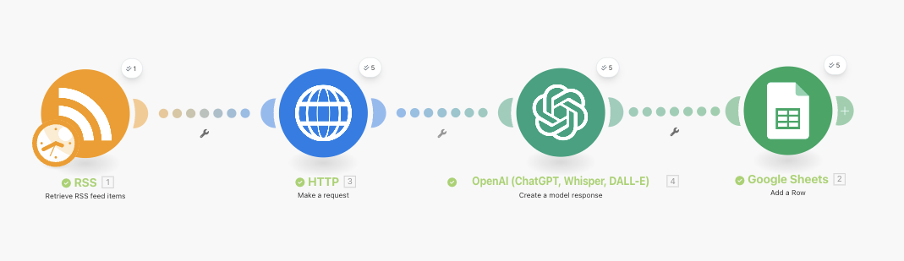
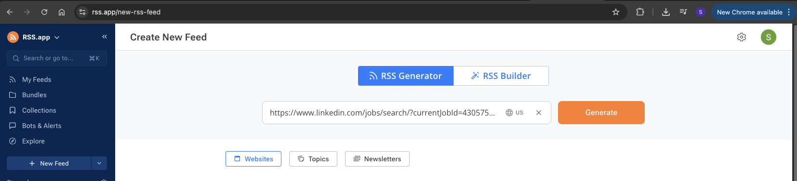
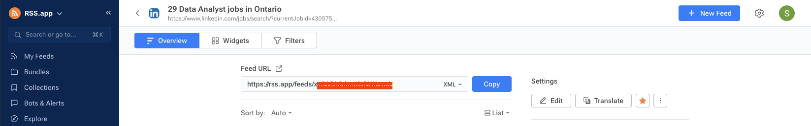

## Introduction

This guide walks you through setting up **LinkedIn Latest Job Automation** on Make.com.  
The automation fetches the newest LinkedIn job posts (based on your search filters) via an RSS feed, parses each item into a structured JSON using OpenAI, and appends the results to a Google Sheet—automatically.

> **At a glance:** RSS → HTTP (GET) → OpenAI → Google Sheets

### What you’ll build
- A reusable Make.com scenario that:
  - Pulls the latest *N* [depends upon the filter and account tier] LinkedIn jobs from an rss.app feed
  - Normalizes each job into a clean JSON (fields you define)
  - Adds each job as a new row in Google Sheets

## Step 1: Create the RSS Feed

To start, you’ll need an RSS feed of LinkedIn job postings that match your filters.  
Since LinkedIn doesn’t provide an official RSS feed, we’ll use **[rss.app](https://rss.app/)** to generate one.

### 1. Get your LinkedIn Jobs URL
1. Go to [LinkedIn Jobs](https://www.linkedin.com/jobs/).
2. Apply all the filters you need, such as:
   - **Location** (e.g., Toronto, Canada)
   - **Job Title / Keywords** (e.g., Data Engineer, Business Analyst)
   - **Date Posted** (e.g., Past 24 hours, Past week)
   - **Experience Level**, **Company**, or any other available filter.
3. Copy the **full URL** from your browser’s address bar.  
   > Example:  
   > `https://www.linkedin.com/jobs/search/?keywords=data%20engineer&location=Toronto%2C%20Canada&f_TPR=r86400`

### 2. Convert it into an RSS Feed
1. Open [rss.app](https://rss.app/).
2. Paste the LinkedIn Jobs URL you copied into the input box.
3. Click **Generate**.

4. Copy the generated **RSS feed link** in xml format.

You’ll use this RSS link in the Make.com scenario to fetch job postings automatically.
