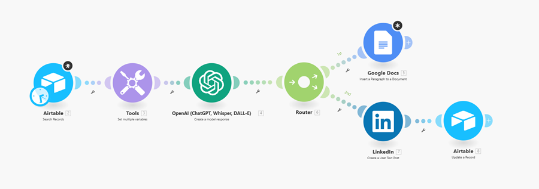

## LinkedIn Post Automation Documentation
The purpose of this document is to provide a clear overview and step-by-step explanation of the Make.com automation workflow that integrates Airtable, OpenAI, Google Docs, and LinkedIn.
### Workflow Overview
This automation takes unprocessed post ideas from Airtable, generates LinkedIn content using OpenAI, logs the results in Google Docs, publishes to LinkedIn, and updates Airtable to mark completion.

 

## The flow ensures:
- No duplicate posts
- AI-generated content is tracked
- Posts are auto-published to LinkedIn

Airtable Integration
Airtable is a cloud-based database platform that combines the simplicity of spreadsheets with the power of relational databases.
•	It is used here as a content management system (CMS) to store LinkedIn post ideas, AI-generated drafts, and processing status.
Integration with Make.com
1.	Add the Airtable module in Make.com.
2.	Authenticate using OAuth 2.0 (recommended for security).
•	Choose Add connection → OAuth.
•	Sign in with your Airtable account.
•	Authorize Make.com to access your bases.

## 2. Workflow Steps
Step 1: Airtable (Search Records)

 
 
 

Module: Airtable → Search Records
Action: Finds all rows where is_processed = FALSE
Purpose: Fetches unprocessed post entries
Limit: Fetch result to 1 at a time
Step 2: Tools (Set Variables)
Module: Tools → Set Multiple Variables
Action: Extracts variables (post_id, Notes, Type, etc.) from Airtable
Purpose: Prepares the data to send to OpenAI
 

## Step 3: OpenAI (Content Generation)
Module: OpenAI (ChatGPT, Whisper, DALL·E) → Create a model response
Action: Sends prompt (based on Airtable Notes & Type) to OpenAI
Purpose: Generates a polished LinkedIn post draft
Steps to Generate OpenAI API Key and Add to Make.com
•	Generate OpenAI API Key
•	Go to OpenAI Platform.
•	Log in with your OpenAI account (or sign up if new).
•	In the top-right corner, click on your profile picture → View API Keys.
•	Click Create new secret key.
•	Copy the key that is generated (it starts with sk-...).

### Store it safely. You won’t be able to see it again after closing the popup.
•	Add OpenAI API Key in Make.com
•	Log in to your Make.com account.
•	Open your Scenario where you’re using OpenAI.
•	Click on the OpenAI module (e.g., ChatGPT, Whisper, DALL·E → Create a model response).
•	In the connection field, click Add.
•	A pop-up will appear asking for your OpenAI API Key.
•	Paste the key you copied from OpenAI.
 

## Step 4: Router (Branching the Workflow)
The router splits the output into two paths:

 

### Path 1 Google Docs (Insert Content)
Module: Google Docs → Insert a Paragraph
Action: Appends a row with: Post_ID, Created_At timestamp, AI-generated Result
Purpose: Keeps a record of every post generated
## Create a Google Drive Connection
1.	In the Connection field of the Google Docs module, click Add.
2.	A popup will appear asking you to connect your Google Account.
3.	Click Continue and log in with the Google account where your Google Docs files are stored.
4.	Review the list of permissions (Make.com needs access to read/write your Google Drive and Docs).
5.	Click Allow to grant access.

## Verify and Save
•	After authentication, the connection will be saved as a reusable Google Drive connection in Make.com.
•	You can now select your Google Drive folder and Docs files inside the module.
 
 

 

### Path 2 LinkedIn (Post Content)
Module: LinkedIn → Create a User Text Post
Action: Publishes AI-generated content to LinkedIn
Purpose: Posts directly on the LinkedIn account
Create LinkedIn Connection
1.	In the Connection field of the LinkedIn module, click Add.
2.	A popup will appear prompting you to sign in to LinkedIn.
3.	Log in with your LinkedIn account credentials (personal or company page admin).
4.	Review the requested permissions (Make.com needs access to post on your behalf and manage content).
5.	Click Allow to grant permissions.

 
## Step 5: Airtable (Update Record)
Module: Airtable → Update Record
Action: Sets is_processed = TRUE for the post after it is successfully published.

Purpose: Prevents reposting and allows new unprocessed entries to flow in the next automation run.

## 3. End-to-End Flow Diagram
The automation flow is:
 
1. Airtable (Search Records) 
2. Tools (Set Variables)
3. OpenAI (Generate Post) 
4. Router
   Path 1: Save to Google Docs
   Path 2: Publish to LinkedIn → Update Airtable (is_processed = TRUE)

## 4. Key Benefits
- Hands-free posting → Content is created and published automatically
- Central tracking → Google Docs acts as a historical log
- Error prevention → Airtable flag avoids duplicate posting
- Scalable → Can handle multiple entries at once with the router

